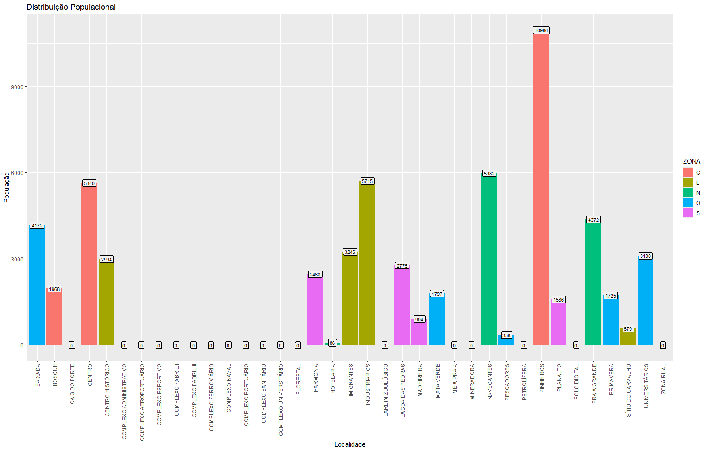
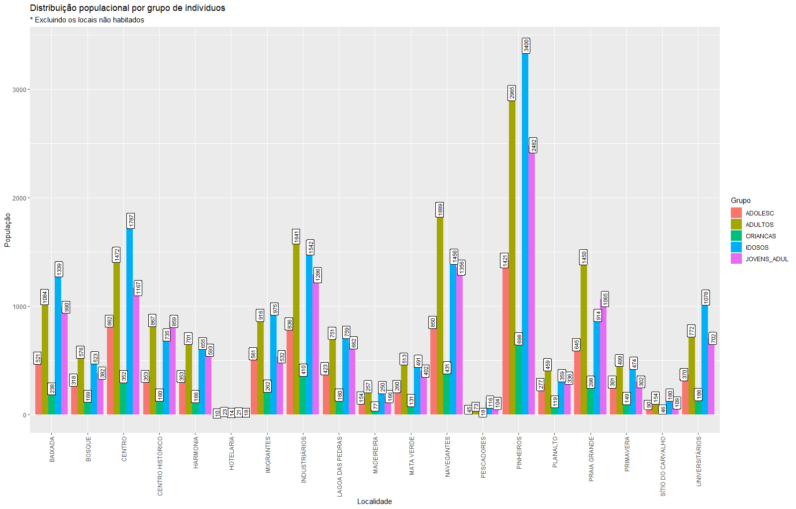
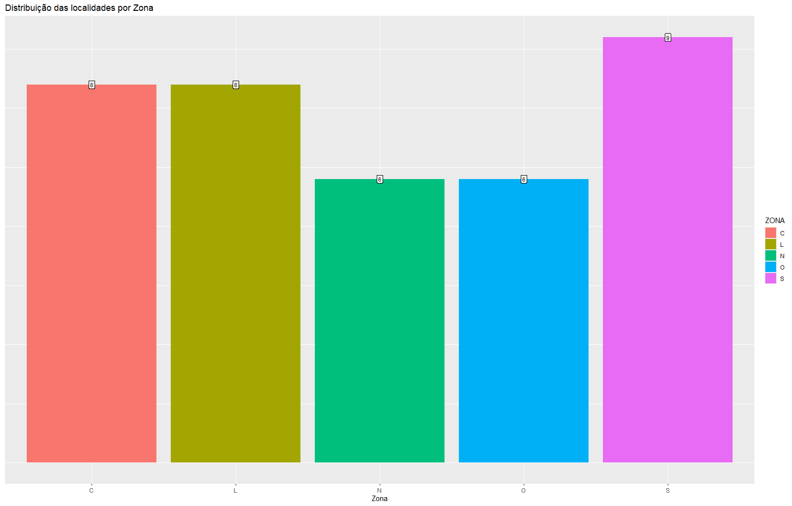
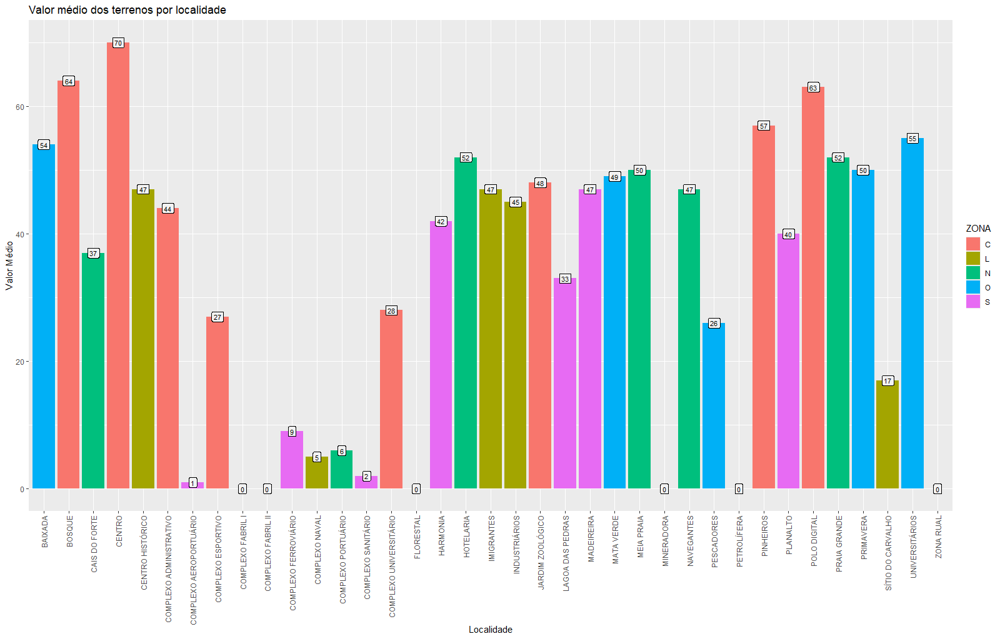
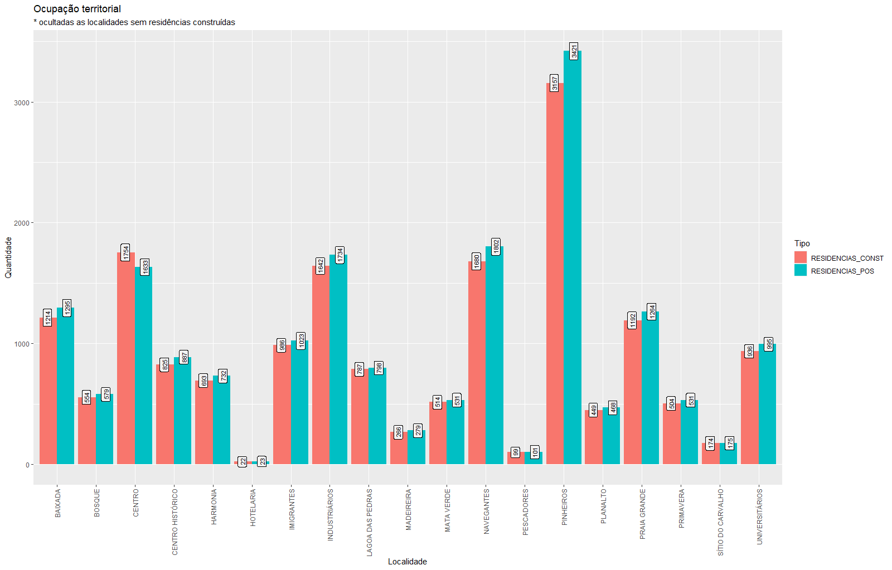
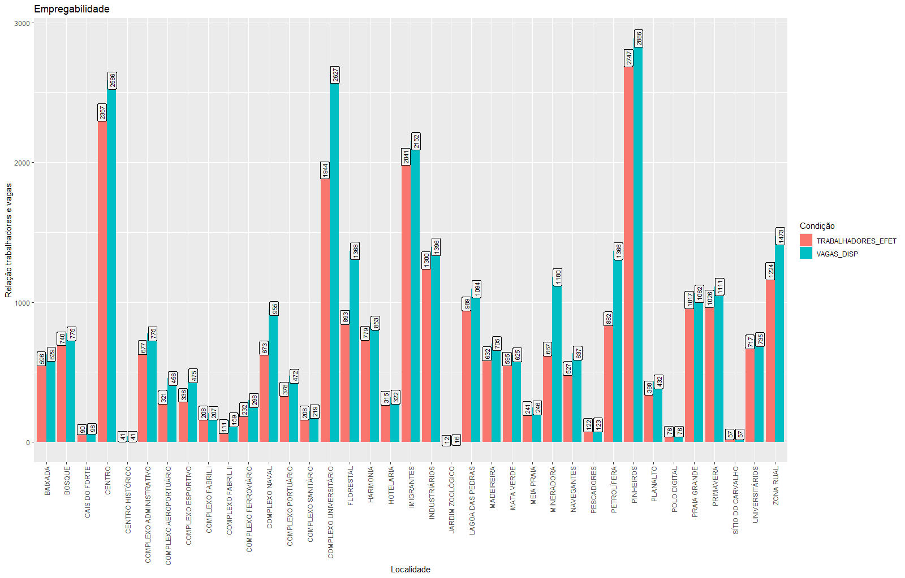
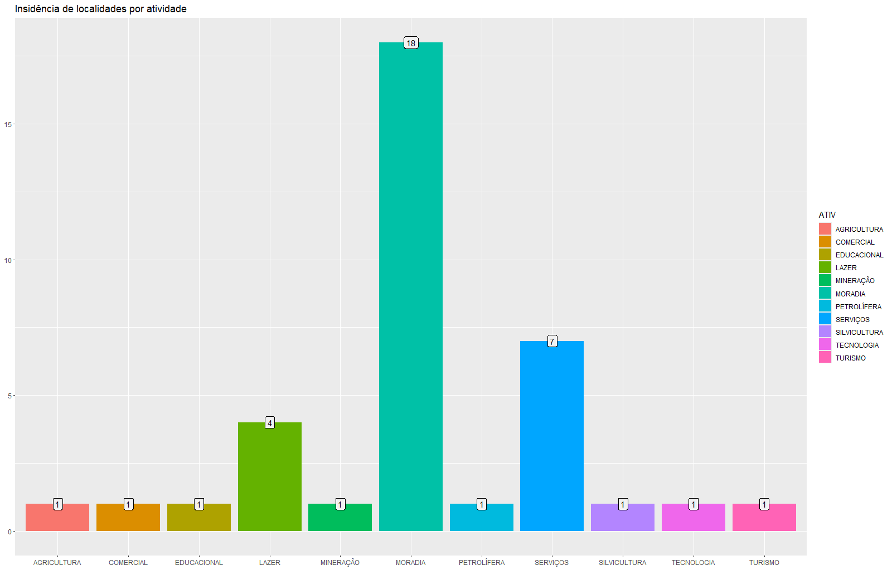

```{r setup, include=FALSE}
knitr::opts_chunk$set(echo = TRUE)

# <setup>

setwd("C:/llpDigital/WebSys_Virtualha/dataAnalysis")

if(!require(RMySQL))
  install.packages("RMySQL")
library(RMySQL)

if(!require(tidyverse))
  install.packages("tidyverse")
library(tidyverse)


# </setup>

# <data>

database <- dbConnect(MySQL(), user='llpdigital', password='password', 
                      dbname='virtualha', host='192.168.0.163')
dbListTables(database)
dbListFields(database, 'localidades')
table  <- dbSendQuery(database, "select * from localidades")
localidades  <-  fetch(table, n=-1)
localidades$DATA_FUND <- as.Date(localidades$DATA_FUND, format = "%Y-%m-%d")
str(localidades)
View(localidades)

# </data>

# <dataCheck>

str(localidades)
summary(localidades)
head(localidades)
tail(localidades)
is.na(localidades)
is.vector(localidades$DATA_FUND)
class(localidades$DATA_FUND)

localidades %>% select(NOME, ZONA, POPULACAO, ATIV)

# </dataCheck>

#<basicInformations>

localidades %>% 
  select(NOME)

populacaototal <- sum(localidades$POPULACAO)
populacaototal


agrupamentos <- localidades %>% 
  select(NOME, CRIANCAS, ADOLESC, JOVENS_ADUL, JOVENS_ADUL, ADULTOS, IDOSOS)
as_tibble(agrupamentos)
agrupamentos

criancas <- paste("Crianças: ", sum(agrupamentos$CRIANCAS))
adolescentes<- paste("Adolescentes: ", sum(agrupamentos$ADOLESC))
jovensAdultos <- paste("Jovens Adultos: ", sum(agrupamentos$JOVENS_ADUL))
adultos <- paste("Adultos: ", sum(agrupamentos$ADULTOS))
idosos <- paste("Idosos: ", sum(agrupamentos$IDOSOS))

paste(criancas, "|", adolescentes, "|", jovensAdultos, "|", adultos, "|", idosos)

vagasTrabalho <- sum(localidades$VAGAS_DISP)
vagasTrabalho

vagasPreenchidas <- sum(localidades$TRABALHADORES_EFET)
vagasPreenchidas

saldoTrabalhista <- (vagasPreenchidas - vagasTrabalho)
saldoTrabalhista


#</basicInformations>

# <manipulations>

localGruposRes <- select(localidades, NOME, ZONA, POPULACAO, CRIANCAS, ADOLESC,
                         JOVENS_ADUL, ADULTOS, IDOSOS)
localGrupos  <-  pivot_longer(localGruposRes,c(
  CRIANCAS, ADOLESC, JOVENS_ADUL, ADULTOS, IDOSOS),
  names_to = "Grupo",
  values_to = "Quantidade")
rm(localGruposRes)
view(localGrupos)

empregabilidadeRes <- localidades %>% 
  select(NOME, ZONA, TRABALHADORES_EFET, VAGAS_DISP)
empregabilidade <- pivot_longer(empregabilidadeRes, c(TRABALHADORES_EFET, VAGAS_DISP),
                                names_to = "Condição",
                                values_to = "Quantidade")
rm(empregabilidadeRes)
view(empregabilidade)

distribAtividade <- localidades %>% 
  select(NOME, ATIV)
view(distribAtividade)

atividade  <-  distribAtividade %>% 
  group_by(ATIV) %>% 
  summarise(
    n = n()
  )
view(atividade)

ocupacaoTerritorial <- localidades %>% 
  select(NOME, RESIDENCIAS_CONST, RESIDENCIAS_POS)
ocupacaoTerritorial <- pivot_longer(ocupacaoTerritorial, c(RESIDENCIAS_CONST, RESIDENCIAS_POS),
                                      names_to = "Tipo",
                                      values_to = "Quantidade")
view(ocupacaoTerritorial)


# </manipulations>

```

## V-01 Localidades

Este documento destina-se a apresentar características específicas de cada localidade do município de Virtualha. Nele serão descritos os seguintes aspectos:

-   Distribuição populacional geral

-   Distribuição populacional por grupo de indivíduos

-   Distribuição das localidades por zona

-   Valor médio territorial

-   Ocupação territorial

-   Empregabilidade

-   Incidência de localidades por tipo de natureza de atividade

Para elaboração deste documento foi utilizada exclusivamente a tabela "localidades" do banco de dados MySQL "virtualha". Mais sobre Virtualha pode ser visto em: [PMV](https://app.netlify.com/sites/websysvirtualhabetav01/overview), e ainda o projeto completo em [GitHub.com](https://github.com/thiagodacosta85/WebSys_Virtualha).

#### Dados sobre a População

População total atual:

```{r Populacao, echo=FALSE}
print(populacaototal)
```

### Visualizações:

Gráfico `Distribuição Populacional`, exibindo em barras a maneira como a população está distribuída.



#### Distribuída da seguinte maneira:

```{r Grupos, echo=FALSE}
paste(criancas, "|", adolescentes, "|", jovensAdultos, "|", adultos, "|", idosos)
```

Gráfico `Distribuição Populacional por grupo de indivíduos` em cada uma das localidades de virtualha, excluíndo da visualização as localidades sem habitações construídas.



Gráfico `Distribuição das localidades por Zona` , demonstrando a quantidade de localidades em cada região geográfica de Virtualha.



Gráfico `Valor médio dos terrenos por localidade` , gráfico com a representação em barras do valor financeiro, e situando a localidade em cores conforme legenda.



Gráfico Ocupação Territorial , gráfico com a representação em barras da ocupação territorial de Virtualha.



#### Dados sobre empregabilidade

```{r empregabilidade, echo=FALSE}
if (vagasPreenchidas < vagasTrabalho) {
  paste("Atualmente o déficit de trabalhadores é de: ", saldoTrabalhista)
} else if(vagasPreenchidas > vagasTrabalho){
  paste("Atualmente o déficit de empregos é de: ", saldoTrabalhista)
}else{
  print("Atualmente o saldo trabalhista de vagas x trabalhadores 100% equilibrado.") 
}

```

Gráfico `Empregabilidade`, exibindo em barras por localidade como esta empregada a força de trabalho da população.

Gráfico `Incidência de localidades por atividade`, exibindo em barras a quantidade de localidades dedicada a cada uma das atividades que se realizam na cidade.


